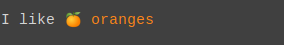
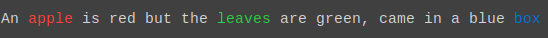
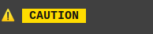

<div align="center">

# @open-tech-world/ansi-styles

[](https://github.com/open-tech-world/ansi-styles/actions/workflows/build.yml) [](https://bundlephobia.com/package/@open-tech-world/ansi-styles)

</div>

> Style your text using [ANSI](https://en.wikipedia.org/wiki/ANSI_escape_code) escape sequences.

## Features

✔️ 24-Bit Colors (True Color)

✔️ Nested Styles

## Supported Styles

✔️ Foreground Colors

✔️ Background Colors

✔️ Bold

✔️ Dim

✔️ Italic

✔️ Underline

✔️ Inverse

✔️ Strikethrough

## Installation

Using npm

```shell
npm install @open-tech-world/ansi-styles
```

Using Yarn

```shell
yarn add @open-tech-world/ansi-styles
```

## Usage

```ts
import { style } from '@open-tech-world/ansi-styles';

style('~styleName[.styleName...]{Text}');
```

## Examples

Using foreground color name

```ts
console.log(style('I like 🍊 ~orange{oranges}'));
```



Using multiple colors

```ts
console.log(
  style(
    'An ~red{apple} is red but the ~green{leaves} are green, came in a blue ~blue{box}'
  )
);
```



Nested colors

```ts
console.log(
  style(
    '~blue{This is a long blue text with some ~red{red} & ~green{green} color in it}'
  )
);
```


Composing different styles

```ts
console.log(style('~bold.white.bgGreen{ PASS }'));
```


Inverse colors

```ts
console.log(style('~inverse.red.bgWhite{ FAILED }'));
```


Faint, decreased intensity, or dim text

```ts
console.log(style('~dim{TEXT}'));
```


Italic fonts

```ts
console.log(style('~italic.fuchsia.bold.bgWhite{ Beautiful Text }'));
```


Underlined texts

```ts
console.log(
  style('Highlighted fruits: ~underline{Apple}, cat, ~underline{Banana}')
);
```


Strikethrough text

```ts
console.log(style('~strike.red{Deleted file.ext}'));
```


Custom functions

```ts
function warning(str) {
  return style(`⚠️  ~bold.black.bgYellow{${str}}`);
}

console.log(warning(' CAUTION '));
```



## Style names

 - Colors

    | Foreground Colors | Background Colors |
    | ----------------- | ----------------- |
    | blue              | bgBlue            |
    | red               | bgRed             |
    | green             | bgGreen           |
    | orange            | bgOrange          |
    | navy              | bgNavy            |
    | aqua              | bgAqua            |
    | teal              | bgTeal            |
    | purple            | bgPurple          |
    | fuchsia           | bgFuchsia         |
    | maroon            | bgMaroon          |
    | yellow            | bgYellow          |
    | olive             | bgOlive           |
    | lime              | bgLime            |
    | black             | bgBlack           |
    | gray              | bgGray            |
    | silver            | bgSilver          |
    | white             | bgWhite           |


- rgb(red, green, blue)

- bgRgb(red, green, blue)

- #### Modifiers
  - bold
  - dim
  - italic
  - underline
  - inverse
  - strike

## References

https://en.wikipedia.org/wiki/ANSI_escape_code

## License

Copyright (c) 2022, [Thanga Ganapathy](https://github.com/Thanga-Ganapathy) ([MIT License](./LICENSE)).
