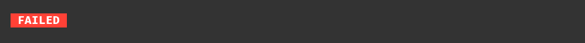
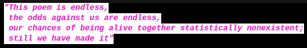

&nbsp;[OPEN TECH FOUNDATION](https://open-tech-foundation.pages.dev/)

<div align="center">

# CLI Styles

[](https://github.com/open-tech-foundation/js-cli-styles/actions/workflows/build.yml)

</div>

> Style your CLI text using [ANSI](https://en.wikipedia.org/wiki/ANSI_escape_code) escape sequences.

## Try it online at [https://node-repl.pages.dev](https://node-repl.pages.dev/)

### [@opentf/std](https://js-std.pages.dev/) - An Extensive JavaScript Standard Library, please review and give feedback.

## Features

- 24-Bit colors only (True Color)

- Nested styles

- Auto detects CLI color support

- Supports RGB & Hex color modes

- Respects [NO_COLOR](https://no-color.org/) & [FORCE_COLOR](https://nodejs.org/api/cli.html#force_color1-2-3)

## Supported Terminals (Popular)

✔️ GNOME Terminal

✔️ Konsole

✔️ xfce4-terminal

✔️ MATE Terminal

✔️ iTerm2

✔️ VS Code

✔️ Tabby

✔️ Hyper

✔️ Alacritty

✔️ Contour

✔️ kitty

✔️ WezTerm

✔️ Windows Terminal

❌ Terminal.app

\*Missing your favorite terminal emulators here? Please give a PR or file an issue in [Github](https://github.com/Open-Tech-Foundation/js-cli-styles/issues/new).

## Installation

```shell
npm install @opentf/cli-styles
```

```shell
yarn add @opentf/cli-styles
```

```shell
pnpm add @opentf/cli-styles
```

## Syntax

```ts
style(str: string, options?: { color: boolean }): string;
```

## Usage

```ts
import { style } from '@opentf/cli-styles';

style('$key[.key...]{Text}');
```

## Examples

Using foreground color

```ts
style(
  '🍊 - An $o{orange} is a fruit of various citrus species in the family Rutaceae.'
);
```


Using multiple colors

```ts
style(
  '$bgy.bl{The $r.bol{R}$g.bol{G}$b.bol{B} color model is an additive color model in which the $r.bol{red}, $g.bol{green} and $b.bol{blue} primary colors of light are added together in various ways to reproduce a broad array of colors.}'
);
```


Nested colors

```ts
style(
  "$bgbl.b{THE QUICK $g{BROWN $r.bol{CAT} JUMPED} OVER THE LAZY $r.bol{DOG}'S BACK}"
);
```


Composing different styles

```ts
style('$bol.w.bgg{ PASS }');
```


Inverse colors

```ts
style('$inv.r.bgw.bol{ FAILED }');
```



Normal vs Bold vs Dim text

```ts
style('Normal text | $bol{Bold text} | $dim{Dimmed text}');
```


Italic fonts

```ts
style(
  '$ita.fuchsia.bol.bgw{"This poem is endless,\n the odds against us are endless,\n our chances of being alive together statistically nonexistent;\n still we have made it"}'
);
```



Underlined texts

```ts
style('Highlighted fruits: $und{Apple}, cat, $und{Banana}');
```


Strikethrough text

```ts
style('Price: $str.r{\\$75.00} $g{\\$50.00}');
```


Code Highlighting:

```js
import { style } from '@opentf/cli-styles';
import hljs from 'highlight.js';
import { decode } from 'html-entities';

function highlight(code) {
  let html = hljs.highlight(code, {
    language: 'js',
  }).value;
  html = html.replaceAll('<span class="hljs-keyword">', '$fuchsia{');
  html = html.replaceAll('<span class="hljs-variable language_">', '$b{');
  html = html.replaceAll('<span class="hljs-title function_">', '$lime{');
  html = html.replaceAll('<span class="hljs-string">', '$y{');
  html = html.replaceAll('<span class="hljs-params"></span>', '');
  html = html.replaceAll('<span class="hljs-comment">', '$gr.dim{');
  html = html.replaceAll('</span>', '}');
  html = decode(html);
  return style(html);
}

const code = `
// Comment
function greet() {
  console.log('Hello World!');
}
`;

console.log(highlight(code));
```


Using Template Literals:

```ts
const cpu = 90;
const ram = 40;
const disk = 70;

const getColor = (n) => (n <= 50 ? 'g' : n > 50 && n <= 70 ? 'y' : 'r');

style(`
 CPU: $${getColor(cpu)}{${cpu}%}
 RAM: $${getColor(ram)}{${ram}%}
DISK: $${getColor(disk)}{${disk}%}
`);
```


Escape characters:

Use double back slashes to escape a character in a string.

```ts
style(
  `<$hex(#39CCCC){input} name=$y{"price"} value=$y{"\\$\\{ Cost + Tax \\}.00"} />`
);
```


Blinking Text:

```ts
style('$g.bol{SALE! -} $blk.r.bol{50% OFFER}');
```


## Color Keys

| Key                   | Description                                                                                                                                                         |
| --------------------- | ------------------------------------------------------------------------------------------------------------------------------------------------------------------- |
| r                     | Red - rgb(255,65,54)                                                                                                                                                |
| g                     | Green - rgb(46,204,64)                                                                                                                                              |
| b                     | Blue - rgb(0,116,217)                                                                                                                                               |
| o                     | Orange - rgb(255,133,27)                                                                                                                                            |
| y                     | Yellow - rgb(255,220,0)                                                                                                                                             |
| w                     | White - rgb(255,255,255)                                                                                                                                            |
| m                     | Magenta - rgb(255,105,193)                                                                                                                                          |
| bl                    | Black - rgb(17,17,17)                                                                                                                                               |
| gr                    | Grey - rgb(170,170,170)                                                                                                                                             |
| navy                  | Navy - rgb(0,31,63)                                                                                                                                                 |
| aqua                  | Aqua - rgb(127,219,255)                                                                                                                                             |
| teal                  | Teal - rgb(57,204,204)                                                                                                                                              |
| purple                | Purple - rgb(177,13,201)                                                                                                                                            |
| fuchsia               | Fuchsia - rgb(240,18,190)                                                                                                                                           |
| maroon                | Maroon - rgb(133,20,75)                                                                                                                                             |
| olive                 | Olive - rgb(61,153,112)                                                                                                                                             |
| lime                  | Lime - rgb(1,255,112)                                                                                                                                               |
| silver                | Silver - rgb(221,221,221)                                                                                                                                           |
| rgb(red, green, blue) | The RGB colors, Eg: rgb(255,0,0) for red color                                                                                                                      |
| hex(#------)          | The 6-digit Hex colors, Eg: hex(#00ff00) for green color                                                                                                            |
| bg\*                  | The background colors can be applied with prefix `bg` to any color keys.<br> Eg: <br/>bgw for white bg<br/>bgrgb(0,0,0) for black bg<br/>bghex(#0000FF) for blue bg |

## Modifier Keys

| Key | Description                           |
| --- | ------------------------------------- |
| res | Reset all attributes to normal        |
| nor | Normal intensity Neither bold nor dim |
| bol | Bold or increased intensity text      |
| dim | Dimmed or decreased intensity text    |
| ita | Italic text                           |
| und | Underlined text                       |
| inv | Swap foreground and background colors |
| str | Strikethrough text                    |
| hid | Hidden text                           |
| dun | Double underlined text                |
| ovl | Overlined text                        |
| blk | Blinking text                         |

## Color Overrides

You can disable colors/styles by the following methods:

- Pass `color` option `false` to the `style` function.

- Pass `--no-color` or `--color=false` to the process arguments.

- Set `FORCE_COLOR=0` in enviroment variables.

You can force enable colors/styles by setting `FORCE_COLOR=3` in enviroment variables.

## Modifier Keys Supported Terminals

| Key | Supported Terminals                                                                                                                                                                                                       |
| --- | ------------------------------------------------------------------------------------------------------------------------------------------------------------------------------------------------------------------------- |
| res | ✅ Gnome Terminal<br/> ✅ Konsole <br/> ✅ xfce4-terminal<br/>✅ MATE Terminal<br/>✅ iTerm2<br/>✅ VS Code<br/>✅ Tabby<br/>✅ Hyper<br/>✅ Alacritty<br/>✅ Contour<br/>✅ kitty<br/>✅ WezTerm<br/>✅ Windows Terminal |
| nor | ✅ Gnome Terminal<br/>✅ Konsole<br/>✅ xfce4-terminal<br/>✅ MATE Terminal<br/>✅ VS Code<br/>✅ Tabby<br/>✅ Hyper<br/>✅ Contour<br/>✅ kitty<br/>✅ WezTerm<br/>✅ Windows Terminal<br/>✅ iTerm2<br/>✅ Alacritty    |
| bol | ✅ Gnome Terminal<br/>✅ Konsole<br/>✅ xfce4-terminal<br/>✅ MATE Terminal<br/>✅ VS Code<br/>✅ Tabby<br/>✅ Hyper<br/>✅ Contour<br/>✅ kitty<br/>✅ WezTerm<br/>✅ Windows Terminal<br/>✅ iTerm2<br/>✅ Alacritty    |
| dim | ✅ Gnome Terminal<br/>✅ Konsole<br/>✅ xfce4-terminal<br/>✅ MATE Terminal<br/>✅ VS Code<br/>✅ Tabby<br/>✅ Hyper<br/>✅ Contour<br/>✅ kitty<br/>✅ WezTerm<br/>✅ Windows Terminal<br/>✅ iTerm2<br/>✅ Alacritty    |
| ita | ✅ Gnome Terminal<br/>✅ Konsole<br/>✅ xfce4-terminal<br/>✅ MATE Terminal<br/>✅ VS Code<br/>✅ Tabby<br/>✅ Hyper<br/>✅ Contour<br/>❌ kitty<br/>✅ WezTerm<br/>✅ Windows Terminal<br/>✅ iTerm2<br/>✅ Alacritty    |
| und | ✅ Gnome Terminal<br/>✅ Konsole<br/>✅ xfce4-terminal<br/>✅ MATE Terminal<br/>✅ VS Code<br/>✅ Tabby<br/>✅ Hyper<br/>✅ Contour<br/>✅ kitty<br/>✅ WezTerm<br/>✅ Windows Terminal<br/>✅ iTerm2<br/>✅ Alacritty    |
| inv | ✅ Gnome Terminal<br/>✅ Konsole<br/>✅ xfce4-terminal<br/>✅ MATE Terminal<br/>✅ VS Code<br/>✅ Tabby<br/>✅ Hyper<br/>✅ Contour<br/>✅ kitty<br/>✅ WezTerm<br/>✅ Windows Terminal<br/>✅ iTerm2<br/>✅ Alacritty    |
| str | ✅ Gnome Terminal<br/>✅ Konsole<br/>✅ xfce4-terminal<br/>✅ MATE Terminal<br/>✅ VS Code<br/>✅ Tabby<br/>✅ Hyper<br/>✅ Contour<br/>✅ kitty<br/>✅ WezTerm<br/>✅ Windows Terminal<br/>✅ iTerm2<br/>✅ Alacritty    |
| hid | ✅ Gnome Terminal<br/>✅ Konsole<br/>✅ xfce4-terminal<br/>✅ MATE Terminal<br/>✅ VS Code<br/>✅ Tabby<br/>✅ Hyper<br/>✅ Contour<br/>❌ kitty<br/>✅ WezTerm<br/>✅ Windows Terminal<br/>❌ iTerm2<br/>✅ Alacritty    |
| dun | ✅ Gnome Terminal<br/>❌ Konsole<br/>✅ xfce4-terminal<br/>✅ MATE Terminal<br/>✅ VS Code<br/>✅ Tabby<br/>❌ Hyper<br/>✅ Contour<br/>✅ kitty<br/>✅ WezTerm<br/>✅ Windows Terminal<br/>❌ iTerm2<br/>❌ Alacritty    |
| ovl | ✅ Gnome Terminal<br/>✅ Konsole<br/>✅ xfce4-terminal<br/>✅ MATE Terminal<br/>✅ VS Code<br/>❌ Tabby<br/>❌ Hyper<br/>✅ Contour<br/>❌ kitty<br/>✅ WezTerm<br/>✅ Windows Terminal<br/>❌ iTerm2<br/>❌ Alacritty    |
| blk | ✅ Gnome Terminal<br/> ✅ Konsole<br/>✅ xfce4-terminal<br/>✅ MATE Terminal<br/>❌ VS Code<br/>❌ Tabby<br/>❌ Hyper<br/>✅ Contour<br/>❌ kitty<br/>✅ WezTerm<br/>✅ Windows Terminal<br/>❌ iTerm2<br/>❌ Alacritty   |

## References

https://en.wikipedia.org/wiki/ANSI_escape_code

https://github.com/termstandard/colors

https://no-color.org/

https://nodejs.org/api/cli.html#force_color1-2-3

https://clrs.cc/

https://developer.chrome.com/docs/devtools/console/format-style/

## Related

- [@opentf/std](https://www.npmjs.com/package/@opentf/std) - A collection of JavaScript utility functions.

- [@opentf/cli-pbar](https://www.npmjs.com/package/@opentf/cli-pbar) - CLI progress bar.

## License

Copyright (c) 2022, [Thanga Ganapathy](https://github.com/Thanga-Ganapathy) ([MIT License](./LICENSE)).
