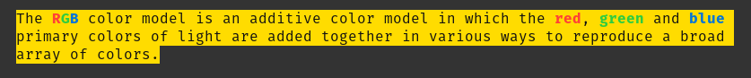

<div align="center">

# CLI Styles

⚡ by [OPEN TECH FOUNDATION](https://open-tech-foundation.pages.dev/)

[](https://github.com/open-tech-foundation/js-cli-styles/actions/workflows/build.yml)

</div>

> Style your CLI text using [ANSI](https://en.wikipedia.org/wiki/ANSI_escape_code) escape sequences.

## Features

✔️ 24-Bit Colors (True Color)

✔️ Nested Styles

✔️ Supports browser dev tools console (Currently chrome & edge browsers only)

## Supported Styles

✔️ Foreground Colors

✔️ Background Colors

✔️ Bold

✔️ Dim

✔️ Italic

✔️ Underline

✔️ Inverse

✔️ Strikethrough

## Installation

Using npm

```shell
npm install @opentf/cli-styles
```

Using Yarn

```shell
yarn add @opentf/cli-styles
```

Using pnpm

```shell
pnpm add @opentf/cli-styles
```

## Syntax

```ts
style(str: string): string;
```

## Usage

```ts
import { style } from '@opentf/cli-styles';

style('~styleName[.styleName...]{Text}');
```

## Examples

Using foreground color name

```ts
style(
  '🍊🍊🍊 - An ~orange{orange} is a fruit of various citrus species in the family Rutaceae.'
);
```


Using multiple colors

```ts
style(
  'The ~red{R}~green{G}~blue{B} color model is an additive color model in which the ~red{red}, ~green{green} and ~blue{blue} primary colors of light are added together in various ways to reproduce a broad array of colors.'
);
```



Nested colors

```ts
console.log(
  style(
    '~blue{This is a long blue text with some ~red{red} & ~green{green} color in it}'
  )
);
```


Composing different styles

```ts
console.log(style('~bold.white.bgGreen{ PASS }'));
```


Inverse colors

```ts
console.log(style('~inverse.red.bgWhite{ FAILED }'));
```


Normal vs Bold vs Dim text(Faint or decreased intensity)

```ts
console.log(style('Normal text | ~bold{Bold text} | ~dim{Dimmed text}'));
```


Italic fonts

```ts
console.log(style('~italic.fuchsia.bold.bgWhite{ Beautiful Text }'));
```


Underlined texts

```ts
console.log(
  style('Highlighted fruits: ~underline{Apple}, cat, ~underline{Banana}')
);
```


Strikethrough text

```ts
console.log(style('~strike.red{Deleted file.ext}'));
```


Code Highlighting:

```js
// demo.js
import { style } from '@opentf/cli-styles';
import hljs from 'highlight.js';
import { decode } from 'html-entities';

function highlight(code) {
  let html = hljs.highlight(code, {
    language: 'js',
  }).value;
  html = html.replaceAll('<span class="hljs-keyword">', '~fuchsia{');
  html = html.replaceAll('<span class="hljs-variable language_">', '~blue{');
  html = html.replaceAll('<span class="hljs-title function_">', '~lime{');
  html = html.replaceAll('<span class="hljs-string">', '~yellow{');
  html = html.replaceAll('<span class="hljs-params"></span>', '');
  html = html.replaceAll('<span class="hljs-comment">', '~gray.dim{');
  html = html.replaceAll('</span>', '}');
  html = decode(html);
  console.log(style(html));
}

const code = `
// Comment
function greet() {
  console.log('Hello World!');
}
`;

highlight(code);
```


## Style names

- Colors

  | Foreground Colors | Background Colors |
  | ----------------- | ----------------- |
  | blue              | bgBlue            |
  | red               | bgRed             |
  | green             | bgGreen           |
  | orange            | bgOrange          |
  | navy              | bgNavy            |
  | aqua              | bgAqua            |
  | teal              | bgTeal            |
  | purple            | bgPurple          |
  | fuchsia           | bgFuchsia         |
  | maroon            | bgMaroon          |
  | yellow            | bgYellow          |
  | olive             | bgOlive           |
  | lime              | bgLime            |
  | black             | bgBlack           |
  | gray              | bgGray            |
  | silver            | bgSilver          |
  | white             | bgWhite           |

- rgb(red, green, blue)

- bgRgb(red, green, blue)

- #### Modifiers
  - bold
  - dim
  - italic
  - underline
  - inverse
  - strike

## References

https://en.wikipedia.org/wiki/ANSI_escape_code

https://developer.chrome.com/docs/devtools/console/format-style/

## License

Copyright (c) 2022, [Thanga Ganapathy](https://github.com/Thanga-Ganapathy) ([MIT License](./LICENSE)).
